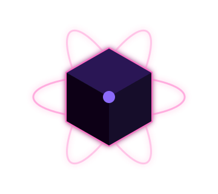
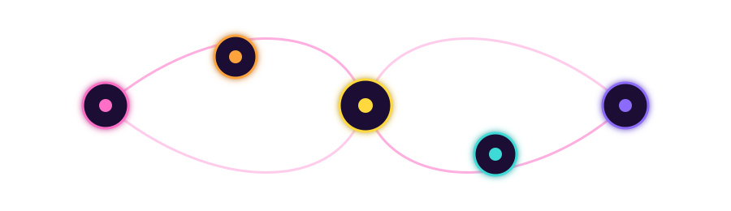
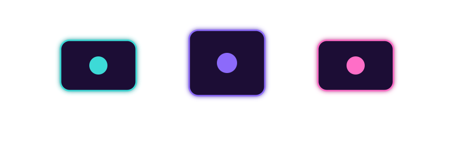
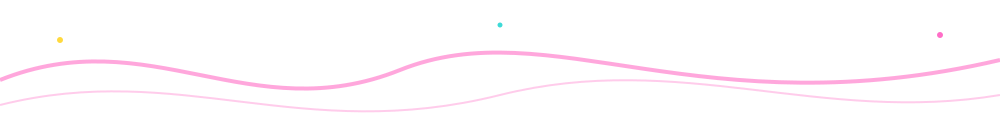

# Hi, I'm Riasf 👋

### Multi-Skilled Creator • Software Engineer • DevOps • OS-Based App Builder • Cybersecurity

 

 

  

## 🚀 About Me

<table>
<tr>
<td width="65%" valign="top">

**Who I Am**

I am a multi-skilled digital creator focused on building real-world technology and business solutions.

**My Main Areas**

- 🔐 Cybersecurity
- 🤖 Automation Tools
- 📈 Business Systems
- 🛠️ Tech Product Building

**My Mindset**

> Build daily. Improve always. Connect knowledge. Create value.

</td>
<td width="35%" align="center" valign="top">

</td>
</tr>
</table>

## 🧠 Knowledge Philosophy

Knowledge shouldn't be locked into a single path. Most education systems split learning into separate fields, subjects, and titles — but in the real world, success comes from combining skills together.

> **Software + Systems + Security + Business = Real-world value**

My goal is to build practical knowledge that solves real problems and creates real impact.

## 💼 Career Areas

| Area | Focus |
|---|---|
|  | Building real software systems |
|  | Deployment, automation, infrastructure |
|  | Desktop and system-level tools |
|  | Security foundations and protection |
|  | Useful tools for real workflows |
|  | Tech products with business value |

## 🛠 Tech & Tools

**Languages & Frontend**

**Tools & Platforms**

## ⚙️ Current Focus

- 🏗️ Building real-world software projects
- 🖥️ Creating OS-based desktop tools
- ⚙️ Improving DevOps and system knowledge
- 🔐 Building cybersecurity foundations
- 🤖 Creating automation tools
- 📊 Developing useful business systems
- 🚀 Building products with technology and business value

## 🎯 Featured Projects

<table>
<tr>
<td width="33%" valign="top" align="center">

**🔹 Project Name**

Add a one-line description of what it does and why it matters.

`Tech` `Stack` `Here`

[View Project →](#)

</td>
<td width="33%" valign="top" align="center">

**🔹 Project Name**

Add a one-line description of what it does and why it matters.

`Tech` `Stack` `Here`

[View Project →](#)

</td>
<td width="33%" valign="top" align="center">

**🔹 Project Name**

Add a one-line description of what it does and why it matters.

`Tech` `Stack` `Here`

[View Project →](#)

</td>
</tr>
</table>

*(Swap these three cards for your real projects — repo link, live demo, whatever fits.)*

## 📊 GitHub Stats

## 📈 Contribution Rhythm

## 🌐 Connect With Me

### "Software • Systems • Security • Business • Growth"

[⬆ Back to top](#top)

